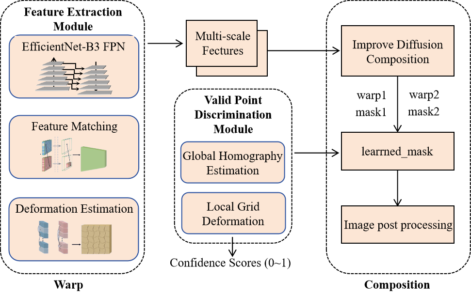

# Unsupervised Disparity - Tolerant Algorithm for Terahertz Image Stitching（UDTATIS）

<p align="center">
  
</p>

## 项目介绍

UDTATIS是一个改进的无监督深度图像拼接系统，它结合了UDIS++的框架和EfficientLOFTR的特征提取与匹配能力。该系统特别针对低分辨率图像（如太赫兹图像）进行了优化，通过引入有效点判别、连续性约束和扩散模型来提高拼接质量。

### 主要特点

- 无监督学习：不需要配对的训练数据
- 视差容忍：能够处理具有视差的图像拼接场景
- 两阶段设计：分别处理几何对齐和图像融合
- 高效特征提取：使用EfficientLOFTR的特征提取器
- 精确特征匹配：引入Transformer进行特征匹配
- 有效点判别：自动识别和过滤不可靠的匹配点
- 连续性约束：保证匹配点的空间连续性
- 扩散模型：使用扩散模型优化图像融合质量
- 自适应归一化：提高网络训练稳定性
- 多尺度特征融合：增强特征提取能力

## 算法架构

系统分为两个主要阶段：

### 1. Warp（变形/对齐）阶段

- **特征提取**：使用EfficientNet作为backbone，结合FPN进行多尺度特征提取
- **特征匹配**：使用Transformer进行特征匹配，考虑全局上下文信息
- **有效点判别**：
  - 使用卷积神经网络评估每个匹配点的可靠性
  - 通过单应性变换误差生成训练标签
  - 动态过滤不可靠的匹配点
- **连续性约束**：
  - 计算特征图的梯度来约束匹配点的连续性
  - 只考虑有效点区域的连续性
  - 平衡连续性和其他损失项
- **变形估计**：
  - 全局单应性估计：使用回归网络估计全局变换参数
  - 局部网格变形：使用TPS（Thin Plate Spline）进行局部变形

### 2. Composition（合成）阶段

- **扩散模型**：
  - 使用U-Net结构的扩散模型进行图像融合
  - 引入时间编码和自适应归一化
  - 支持多尺度特征提取和融合
- **注意力机制**：
  - 使用注意力机制增强特征融合
  - 自适应调整特征权重
- **残差连接**：
  - 添加残差连接改善梯度流动
  - 提高网络训练稳定性
- **损失函数**：
  - 边界损失：保证拼接边界的平滑性
  - 平滑损失：确保图像内容的连续性
  - 感知损失：保持图像的高层语义信息
  - 多尺度损失：考虑不同尺度的特征匹配
  - 动态权重：自适应调整各损失项的权重

## 环境要求

```bash
# 基础环境
numpy==1.19.5
pytorch==1.7.1
scikit-image==0.15.0
tensorboard==2.9.0
matplotlib==3.5.1
torchvision==0.8.2

# 新增依赖
efficientnet-pytorch
tqdm
opencv-python
```

## 安装步骤

1. 克隆仓库：
```bash
git clone https://github.com/your-username/UDTATIS.git
cd UDTATIS
```

2. 安装依赖：
```bash
pip install -r requirements.txt
```

3. 下载预训练权重：
- 从EfficientLOFTR官方仓库下载预训练权重
- 将权重文件放在 `Warp/pretrained/` 目录下

## 数据集准备

使用UDIS-D数据集进行训练和测试：
1. 下载UDIS-D数据集
2. 将数据集放在 `data/UDIS-D/` 目录下
3. 数据集结构：
```
data/UDIS-D/
  ├── training/
  │   ├── img1/
  │   └── img2/
  └── testing/
      ├── img1/
      └── img2/
```

## 数据流转逻辑

UDTATIS系统的工作流程中，一个关键部分是从Warp阶段到Composition阶段的数据流转。这个过程已经在代码中被优化，确保了从Warp到Composition的无缝衔接：

### Warp到Composition的数据准备

Warp模型处理原始图像对后，会生成变形后的图像和对应的掩码，这些数据会被保存到专门的目录中供Composition阶段使用：

1. **数据存储位置**：所有Warp处理后的数据会被存储在 `data/UDIS-D/composition_data/` 目录下
2. **目录结构**：
   ```
   data/UDIS-D/composition_data/
   ├── train/             # 训练数据集
   │   ├── warp1/         # 第一张图像的变形结果
   │   ├── warp2/         # 第二张图像的变形结果
   │   ├── mask1/         # 第一张图像的掩码
   │   └── mask2/         # 第二张图像的掩码
   └── test/              # 测试数据集
       ├── warp1/
       ├── warp2/
       ├── mask1/
       └── mask2/
   ```

### 自动数据准备流程

系统会在以下情况下自动进行数据准备：

1. **首次训练Composition模块时**：当检测到composition训练数据不存在时，系统会自动调用Warp模型处理训练图像对
2. **首次测试Composition模块时**：当检测到composition测试数据不存在时，系统会自动调用Warp模型处理测试图像对
3. **端到端测试时**：在end2end模式下，系统会依次执行Warp测试和数据准备，然后再执行Composition测试

### 数据处理流程

数据处理的具体流程如下：

1. **加载训练好的Warp模型**：系统会优先使用用户指定的模型，如未指定则会自动查找最新的checkpoint
2. **处理原始图像对**：Warp模型会对每对图像执行以下操作：
   - 提取图像特征并进行匹配
   - 估计单应性变换和网格变形
   - 应用变换生成变形后的图像
   - 生成反映变形区域的掩码
3. **保存处理结果**：将变形图像和掩码保存到指定目录
4. **更新配置**：自动更新配置，使Composition模块使用新生成的数据

### 可靠性增强机制

为提高数据准备的可靠性，系统实现了以下机制：

1. **自动回退**：当无法找到Warp模型或数据加载失败时，系统会自动回退到生成虚拟数据
2. **掩码优化**：使用改进的掩码生成算法，通过形态学操作和连通区域分析提高掩码质量
3. **错误处理**：对每对图像的处理使用异常捕获，确保单对图像处理失败不会影响整体流程
4. **临时文件管理**：使用Python的tempfile模块处理临时文件，确保资源正确释放

## 快速开始

使用main.py可以方便地训练和测试整个系统：

1. 训练整个系统：
```bash
python main.py --mode train --part all
```

2. 只训练Warp部分：
```bash
python main.py --mode train --part warp
```

3. 只训练Composition部分（会自动准备数据）：
```bash
python main.py --mode train --part composition
```

4. 测试整个系统：
```bash
python main.py --mode test --part all
```

5. 端到端测试（Warp结果自动输入到Composition）：
```bash
python main.py --mode end2end --model_path path/to/model
```

6. 只准备Composition数据而不进行训练：
```bash
python main.py --mode train --part composition --prepare_only
```

7. 使用特定Warp模型准备Composition数据：
```bash
python main.py --mode train --part composition --prepare_only --model_path path/to/warp_model
```

8. 使用自定义配置文件：
```bash
python main.py --config custom_config.json --mode train --part all
```

9. 使用虚拟数据测试系统（无需真实数据集）：
```bash
python main.py --mode test --part all --virtual
```

## 系统验证

提供了全面的系统测试脚本以验证各模块功能：

```bash
# 测试整个系统
python test_system.py

# 使用虚拟数据
python test_system.py --virtual

# 使用GPU加速测试
python test_system.py --virtual --gpu
```

`test_system.py` 会执行以下测试：
- Warp模块的数据加载和模型功能
- Composition模块的数据加载和模型功能
- main.py脚本的正确性
- 小规模训练循环的正确性

测试成功后，将显示详细的功能验证结果，确保系统各部分正常工作。

## 模型可视化工具

UDTATIS提供了强大的可视化工具，可以帮助理解和调试Warp和Composition两个阶段的内部工作机制。这些工具位于`draw`目录下，通过钩子机制捕获网络的中间特征和处理过程。

### 可视化工具概述

- **Warp过程可视化**：展示特征提取、匹配、有效点判别和图像变形过程
- **Composition过程可视化**：展示扩散模型的前向传播、采样过程和最终融合效果
- **特征图可视化**：将网络中间层的多通道特征转换为直观的热力图
- **掩码可视化**：展示模型学习到的融合掩码
- **对比可视化**：并排展示输入图像和处理结果的对比

### 使用方法

#### 可视化Warp过程

```bash
# 基本用法
python draw/visualize_warp.py

# 自定义参数
python draw/visualize_warp.py --image1_dir data/source --image2_dir data/target --output_dir results/warp_vis

# 使用辅助脚本(更便捷)
bash draw/run_warp_visualization.sh
```

主要参数:
- `--image1_dir`/`--image2_dir`: 输入图像目录
- `--output_dir`: 输出结果保存目录
- `--model_path`: Warp模型权重路径
- `--device`: 运行设备(cuda/cpu)

#### 可视化Composition过程

```bash
# 基本用法
python draw/visualize_composition.py --warp1 images/warp1.png --warp2 images/warp2.png --mode full

# 完整参数
python draw/visualize_composition.py --warp1 images/warp1.png --warp2 images/warp2.png --mask1 images/mask1.png --mask2 images/mask2.png --output_dir results/composition --mode sample --vis_steps 20

# 使用辅助脚本(支持批处理)
bash draw/run_composition_visualization.sh --warp1_dir images/warp1 --warp2_dir images/warp2 --mode sample
```

主要参数:
- `--warp1`/`--warp2`: 变形后的图像路径
- `--mask1`/`--mask2`: 对应的掩码路径(可选)
- `--mode`: 可视化模式(full/forward/sample)
- `--vis_steps`: 可视化的采样步数
- `--low_memory`: 低内存模式

### 输出结果

运行可视化工具后，输出结果将保存在指定目录下：

1. **Warp过程输出**:
   - 输入图像可视化
   - 特征图可视化
   - 变形网格可视化
   - 单应性和TPS变换结果
   - 原始与变形图像对比

2. **Composition过程输出**:
   - 输入图像和掩码
   - 前向传播结果
   - 采样过程中间步骤
   - 最终融合结果
   - 原始与融合结果对比

### 扩展功能

可视化工具支持多种扩展功能：

- **批量处理**: 通过辅助脚本支持批量处理多对图像
- **指标记录**: 可选择将指标保存为CSV表格
- **低内存模式**: 针对资源受限的环境优化内存使用
- **自定义掩码**: 支持使用自定义掩码替代模型生成的掩码

更多详细信息，请参考 `draw/README.md` 文件。

## 配置说明

系统使用config.json文件进行配置，主要包含以下部分：

### Warp部分配置
```json
{
    "warp": {
        "train": {
            "gpu": "0",
            "batch_size": 8,
            "max_epoch": 100,
            "learning_rate": 1e-4,
            "train_path": "data/UDIS-D/training",
            "model_save_path": "Warp/model",
            "summary_path": "Warp/summary",
            "loss_weights": {
                "homography": 1.0,
                "mesh": 1.0,
                "feature": 0.1,
                "valid_point": 0.5,
                "continuity": 0.2
            }
        },
        "test": {
            "gpu": "0",
            "batch_size": 1,
            "test_path": "data/UDIS-D/testing",
            "result_path": "Warp/results",
            "model_path": "Warp/model/checkpoint_latest.pth"
        }
    }
}
```

### Composition部分配置
```json
{
    "composition": {
        "train": {
            "gpu": "0",
            "batch_size": 8,
            "max_epoch": 100,
            "learning_rate": 1e-4,
            "train_path": "data/UDIS-D/composition_data/train",
            "model_save_path": "Composition/model",
            "summary_path": "Composition/summary",
            "loss_weights": {
                "boundary": 1.0,
                "smooth": 1.0,
                "perceptual": 0.5,
                "multi_scale": 0.5,
                "diffusion": 1.0
            },
            "diffusion": {
                "num_timesteps": 1000,
                "beta_start": 1e-4,
                "beta_end": 0.02
            }
        },
        "test": {
            "gpu": "0",
            "batch_size": 1,
            "test_path": "data/UDIS-D/composition_data/test",
            "result_path": "Composition/results",
            "save_dirs": {
                "learn_mask1": "learn_mask1",
                "learn_mask2": "learn_mask2",
                "composition": "composition",
                "denoised": "denoised",
                "visualization": "visualization"
            }
        }
    }
}
```

### 数据流转配置说明

1. **原始数据路径**：
   - `warp.train.train_path`：Warp训练使用的原始训练数据路径
   - `warp.test.test_path`：Warp测试使用的原始测试数据路径

2. **Warp结果路径**：
   - `warp.test.result_path`：Warp测试生成的结果保存路径

3. **Composition数据路径**：
   - `composition.train.train_path`：Composition训练使用的数据路径，会被自动更新为准备好的数据路径
   - `composition.test.test_path`：Composition测试使用的数据路径，会被自动更新为准备好的数据路径

4. **自动更新机制**：
   - 当系统准备好Composition数据后，会自动更新配置文件中的相关路径
   - 默认情况下，Composition数据会保存在 `data/UDIS-D/composition_data/` 目录下
   - 训练数据保存在 `data/UDIS-D/composition_data/train/` 目录下
   - 测试数据保存在 `data/UDIS-D/composition_data/test/` 目录下

## main.py核心功能

`main.py`作为系统入口，提供以下关键功能：

1. **模块化设计**：分离Warp和Composition模块以便独立训练和测试
2. **灵活运行模式**：支持训练、测试和端到端模式
3. **自动资源管理**：检测GPU可用性并自动适配
4. **配置管理**：从配置文件读取参数，支持命令行覆盖
5. **虚拟数据支持**：可使用虚拟数据进行系统功能验证
6. **详细日志记录**：训练和测试过程中记录详细信息和时间统计
7. **端到端集成**：提供Warp和Composition的无缝衔接

## 性能优化

系统实现了多项性能优化技术：

1. **GPU加速**：充分利用GPU资源进行计算
2. **混合精度训练**：在Composition模块中使用半精度训练加速
3. **动态学习率**：使用学习率预热和调度器提高训练效率
4. **批处理优化**：自动选择最佳批大小以平衡速度和内存使用
5. **并行数据加载**：使用多线程数据加载加速训练过程
6. **梯度裁剪**：防止梯度爆炸，提高训练稳定性
7. **自动内存管理**：根据系统资源自动调整内存使用

## 高级用法

### 自定义损失权重

调整损失权重以适应不同场景，例如增大连续性损失权重：

```bash
python main.py --mode train --part warp --custom_loss_weights '{"continuity": 0.5}'
```

### 迁移学习

利用预训练模型快速适应新数据集：

```bash
python main.py --mode train --part all --pretrained path/to/model --learning_rate 1e-5
```

### 扩散模型参数调整

修改扩散过程参数以优化图像融合质量：

```bash
python main.py --mode train --part composition --diffusion_timesteps 500 --beta_schedule 'linear'
```

### 模型导出和部署

导出训练好的模型用于部署：

```bash
python export_model.py --model_path path/to/model --export_format onnx
```

## 结果评估

系统会输出以下评估指标：
- PSNR (Peak Signal-to-Noise Ratio)：衡量图像质量
- SSIM (Structural Similarity Index)：衡量结构相似性
- 有效点比例：衡量匹配点的可靠性
- 连续性损失：衡量匹配点的空间连续性
- 扩散质量评估：评估扩散模型的去噪效果
- 边界平滑度：评估拼接边界的平滑程度
- 视觉质量评估：生成可视化结果展示拼接效果

输出结果将保存在配置文件指定的目录中，包括：
- 变形后的图像（Warp结果）
- 有效点掩码
- 学习到的融合掩码
- 拼接结果图像
- 扩散模型优化后的图像
- 可视化比较结果

## 预训练模型

我们提供了两个阶段的预训练模型：
1. Warp阶段模型：[下载链接](https://drive.google.com/file/d/1GBwB0y3tUUsOYHErSqxDxoC_Om3BJUEt/view?usp=sharing)
2. Composition阶段模型：[下载链接](https://drive.google.com/file/d/1OaG0ayEwRPhKVV_OwQwvwHDFHC26iv30/view?usp=sharing)

## 引用

如果您使用了本代码，请引用以下论文：

```bibtex
@inproceedings{nie2023parallax,
  title={Parallax-Tolerant Unsupervised Deep Image Stitching},
  author={Nie, Lang and Lin, Chunyu and Liao, Kang and Liu, Shuaicheng and Zhao, Yao},
  booktitle={Proceedings of the IEEE/CVF International Conference on Computer Vision},
  pages={7399--7408},
  year={2023}
}
```

## 联系方式

如有任何问题，请联系：
- 邮箱：nielang@bjtu.edu.cn
- GitHub Issues：[提交问题](https://github.com/your-username/UDTATIS/issues)

## 系统工作流程

下面详细描述了UDTATIS系统的完整工作流程，包括训练和测试阶段：

### 训练流程

<p align="center">
  
</p>

1. **原始数据准备**：
   - 将UDIS-D数据集放置在指定路径
   - 确保训练数据包含img1和img2子目录

2. **Warp模块训练**：
   - 导入原始训练数据
   - 提取特征并进行匹配
   - 计算单应性变换和局部网格变形
   - 应用多种损失函数优化网络
   - 保存训练好的Warp模型

3. **数据流转处理**：
   - 使用训练好的Warp模型处理原始图像对
   - 生成变形图像和掩码
   - 保存到Composition训练数据目录

4. **Composition模块训练**：
   - 导入生成的训练数据（变形图像和掩码）
   - 使用扩散模型进行图像融合
   - 优化融合边界和过渡区域
   - 保存训练好的Composition模型

### 测试流程

<p align="center">
  
</p>

1. **原始测试数据准备**：
   - 确保测试数据放置在指定路径
   - 测试数据包含img1和img2子目录

2. **Warp模块测试**：
   - 加载训练好的Warp模型
   - 处理测试图像对
   - 生成变形图像
   - 保存中间结果

3. **测试数据流转**：
   - 使用Warp处理的结果准备Composition测试数据
   - 生成变形图像和掩码
   - 保存到Composition测试数据目录

4. **Composition模块测试**：
   - 加载训练好的Composition模型
   - 处理变形图像和掩码
   - 生成最终拼接结果和可视化效果
   - 计算评估指标

### 端到端测试流程

端到端测试模式下，系统会自动完成以下流程：
1. 执行Warp测试
2. 准备Composition测试数据
3. 执行Composition测试
4. 生成最终结果

### 数据流转优化

最新版本的系统对数据流转过程进行了以下优化：

1. **优化掩码生成算法**：
   - 使用自适应阈值和形态学操作
   - 识别并保留有效连通区域
   - 过滤噪声和小区域

2. **增强错误处理**：
   - 单对图像处理失败不会影响整体流程
   - 自动回退到虚拟数据生成机制
   - 临时文件使用标准模块管理

3. **自动化数据管理**：
   - 自动检测和准备必要的数据
   - 动态更新配置路径
   - 规范化的目录结构

4. **效率提升**：
   - 批处理图像减少I/O开销
   - 利用GPU并行处理
   - 智能限制处理图像数量，平衡数据量和训练需求

通过这些优化，Warp到Composition的数据流转变得更加可靠、高效和自动化，大大简化了系统的使用流程。

## 许可证

本项目采用 [MIT License](LICENSE) 进行许可。

## 批量测试

```bash
python Composition/Codes/simple_test.py --test_path 测试数据路径 --result_path 结果保存路径 --pretrained_path 模型路径 --gpu 0
```

## 单图像对测试

```bash
python Composition/Codes/simple_test.py --single_test --warp1 图像1路径 --warp2 图像2路径 --mask1 掩码1路径 --mask2 掩码2路径 --output_dir 输出目录 --pretrained_path 模型路径
```

## 简化版单图像对测试

如果您只需要针对Composition过程进行简单的测试，无需加载复杂的扩散模型，可以使用以下轻量级脚本：

```bash
python Composition/Codes/test_composition.py --warp1 图像1路径 --warp2 图像2路径 --mask1 掩码1路径 --mask2 掩码2路径 --output_dir 输出目录
```

这个简化版脚本使用简单的线性混合方法对图像进行合成，适合快速验证数据和掩码是否正确。它提供以下输出：

1. **输入图像**: `input1.jpg`和`input2.jpg`
2. **掩码图像**: `mask1.jpg`和`mask2.jpg`
3. **合成结果**: `composition.jpg`
4. **可视化结果**: `visualization.png` - 包含所有输入、输出图像的对比图
5. **评估指标**: `metrics.txt` - 包含PSNR和SSIM等客观评价指标

脚本会自动处理单通道和多通道掩码，确保合成过程正确进行。整个过程不依赖GPU，运行速度快，适合用于快速调试和结果预览。

### 使用案例

测试数据集中的单个图像对：
```bash
python Composition/Codes/test_composition.py \
  --warp1 ./data/UDIS-D/composition_data/train/warp1/000000.jpg \
  --warp2 ./data/UDIS-D/composition_data/train/warp2/000000.jpg \
  --mask1 ./data/UDIS-D/composition_data/train/mask1/000000.jpg \
  --mask2 ./data/UDIS-D/composition_data/train/mask2/000000.jpg \
  --output_dir ./test_results/single_test
```

# 分布式训练

本项目现已支持基于PyTorch分布式数据并行(DDP)的单机多卡和多机训练。使用以下命令启动分布式训练：

```bash
# 推荐方式：使用torchrun脚本（更可靠）
./run_torchrun.sh --gpus 4 --part composition --data_dir /path/to/data

# 传统方式：
python train_distributed.py --gpus 4 --part composition --data_dir /path/to/data
```

## 分布式训练注意事项

1. `batch_size`参数表示每个GPU的批次大小，总批次大小 = `batch_size` × GPU数量
2. 确保每个GPU有足够的内存，如果出现OOM错误，请尝试减小`batch_size`或启用梯度累积
3. 分布式训练使用NCCL后端，对NVIDIA GPU优化
4. 只有rank 0进程会保存模型、记录日志和执行验证
5. 同步BatchNorm可以通过`--sync_bn`参数启用，以提高多卡训练的稳定性

## 单卡训练

如果只有单张GPU或不想使用分布式训练，可以使用以下命令：

```bash
python main.py --mode train --part composition --data_dir /path/to/data
```

## 更详细的分布式训练说明

请参阅 [DISTRIBUTED_TRAINING.md](DISTRIBUTED_TRAINING.md) 获取更详细的分布式训练说明，包括参数详解、多机训练配置和故障排除指南。

## 最近的改进

最近我们对系统进行了一系列优化，特别是在Composition模块方面：

### Composition模块改进

1. **直接图像处理**：改进了`apply_composition_mask_processing`函数，使其能够直接处理图像而不是使用子进程调用，提高了性能和可靠性。

2. **测试和调试工具**：开发了三个专门的测试脚本：
   - `test_composition_directly.py`：直接测试`process_mask_for_composition`函数
   - `test_composition_full.py`：实现包含模型预测和后处理的完整端到端测试
   - `test_composition_debug.py`：在测试过程中提供详细信息，用于调试目的

3. **错误处理和目录管理**：实现了适当的错误处理，并确保创建所有必要的目录，包括mask目录。

4. **性能监控**：所有测试脚本现在都会测量和报告处理时间，测试显示：
   - 模型预测每张图像大约需要10秒
   - 后处理非常快（约0.15秒）
   - 平均总处理时间约为每张图像10秒

5. **结果组织**：处理后的图像现在正确保存在适当的目录中，合并结果存储在"merged"目录中。

### 使用新测试工具

1. **基本Composition测试**：
```bash
python test_composition_directly.py --data_dir data/UDIS-D/composition_data/test --output_dir Composition/direct_test_results
```

2. **带模型的完整Composition测试**：
```bash
python test_composition_full.py --model_path Composition/model/model_latest.pth --test_data data/UDIS-D/composition_data/test
```

3. **交互式调试**：
```bash
python test_composition_debug.py --interactive --limit 5
```

这些工具提供不同级别的测试和调试功能：
- `test_composition_directly.py`：仅测试不带模型预测的合成过程
- `test_composition_full.py`：测试包括模型预测和合成在内的完整流程
- `test_composition_debug.py`：提供详细的日志记录和可视化功能，用于调试目的
